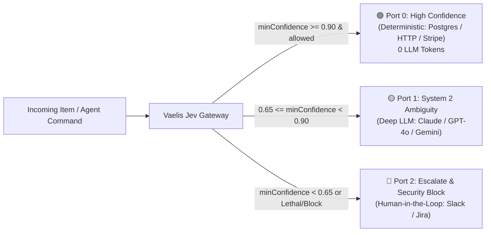

# Jev Fast-Path Gateway for n8n

[](https://www.npmjs.com/package/n8n-nodes-vaelis)
[](LICENSE)
[](#testing--verification)
[](https://www.typescriptlang.org/)
[](https://docs.n8n.io/integrations/community-nodes/)

> **The Enterprise-Grade System 1 Gateway for TypeSafe Jev in n8n workflows.**  
> Sub-80ms calibrated classification, 3-tier physical routing, AI agent guardrails, and deterministic fast-paths powered discretely by the high-performance [`@cubicmaldo/vaelis`](https://github.com/CubicMaldo/vaelis) engine.

---

## ⚡ The System 1 Architecture Axiom

> *"Classify in <80 ms, route deterministically in code, and delegate to heavy generative LLMs only by exception."*

Standard LLM nodes (GPT-4o, Claude 3.5 Sonnet, Gemini Pro) are slow (1,500 - 4,000 ms) and expensive ($3 - $15 / million tokens) when used simply to categorize incoming data, check policies, or route tickets.

**`n8n-nodes-vaelis`** brings the **TypeSafe Jev** model directly to your n8n workflows as an industrial-grade **System 1 Gateway**. By leveraging mathematical calibrated probabilities and perimeter defenses, your workflows decide routing in milliseconds, consume **0 LLM tokens** for confident operations, and instantly block lethal agent commands.

---

## 🚀 Why This Node Outperforms Standard Jev Implementations

While basic community nodes (such as `n8n-nodes-jev`) act as simple HTTP wrappers around the API, `n8n-nodes-vaelis` is an **architected safety gateway** built for production autonomy:

| Capability | `n8n-nodes-jev` | `n8n-nodes-vaelis` (Enterprise Jev Gateway) |
| :--- | :---: | :---: |
| **Physical Output Ports** | Single output or soft switch | **3 Distinct Physical Output Ports** (`High`, `Medium`, `Escalate`) |
| **Zero-Token Fast-Path** | ❌ Unconditional LLM token spend | **✅ 0 LLM Tokens** on deterministic path ($\ge 0.90$ confidence) |
| **Perimeter Static Guardrail** | ❌ None | **✅ Sub-1ms Static Regex Defense** (`rm -rf`, `DROP TABLE`, etc.) |
| **Prompt Injection Defense** | ❌ None | **✅ Dual-Query Cross-Check & Adversarial Freeze** |
| **Offline / Resilient Fallback** | ❌ Workflow fails on 429 / outage | **✅ Automatic Gemini Flash Fallback** (99.99% uptime) |
| **Context Window Bounding** | ❌ Unbounded payload size | **✅ Strict 32k Token / Character Sanitizer** |
| **Connection Pooling** | ❌ New HTTP client per item | **✅ In-memory Gateway & Client Connection Pooling** |
| **Live Savings Telemetry** | ❌ None | **✅ Computes `tokenSavingsPercent` & `costSavingsEstimateUsd`** |
| **AI Agent Tool Support** | Basic tool mode | **✅ Native Agent Tool (`usableAsTool: true`)** |

---

## 🔌 3 Physical Hardware-like Output Ports

Unlike conventional single-output nodes that require cascades of IF/Switch nodes, `n8n-nodes-vaelis` splits execution physically into 3 hardware-like terminals:



1. **Port 0 — High Confidence (Deterministic Fast-Path)**:
   - Activates when `allowed: true` and calibrated confidence exceeds `highThreshold` ($\ge 0.90$).
   - Connects straight to deterministic nodes (Postgres, HTTP Request, Stripe, Redis). Consumes **0 LLM tokens** and completes in <80 ms.
2. **Port 1 — System 2 Ambiguity (Deep Semantic Reasoning)**:
   - Activates when confidence is moderate (`ambiguityThreshold <= minConfidence < highThreshold`, ej. 0.65 a 0.89).
   - Awakes heavy generative models (Claude 3.5 Sonnet, GPT-4o, Gemini 2.5 Flash) only when real semantic deliberation is needed.
3. **Port 2 — Escalate (HITL / Security Block)**:
   - Activates on security violations (`allowed: false`), static lethal pattern detection, cross-check dissonance (`CROSS_CHECK_DISSONANCE`), or low confidence (<0.65).
   - Routes straight to human escalation queues (Slack channel, Jira ticket, PagerDuty).

---

## 🛠 Operations

### 1. `interceptToolCall` (Perimeter Agent Guardrail)
Designed specifically for autonomous agent workflows (LangChain, AutoGPT, n8n AI Agents):
- **Pre-Guardrail Estático (<1 ms)**: Intercepts lethal commands (`rm -rf`, `DROP TABLE`, `TRUNCATE`, `mkfs`, `FORMAT`, `chmod -R 777`) in sub-millisecond execution without calling external APIs.
- **Dual-Vector Inspection**: Evaluates safety and destructive impact against execution environment (`isProduction`, `role`).
- **Telemetry in Item**: Returns `vaelis.allowed`, `vaelis.latencyMs`, `vaelis.routing`, and specific sub-decisions.

### 2. `evaluateState` (Calibrated Classification & Scoring)
Evaluates any incoming text or JSON against typed questions:
- **`choice`**: Categorical classification (e.g. `billing`, `technical`, `sales`, `cancellations`).
- **`noul`**: Binary boolean probability (0.0 to 1.0 calibrated likelihood of TRUE).
- **`score`**: Continuous intensity or risk scoring (0.0 to 1.0).
- **Input Flexibility**: Reads from plain text, expressions (`{{ $json.ticket }}`), full input items, or custom JSON.
- **JSON Question Mode**: Supports the complete official TypeSafe JSON question schema.

---

## 📦 Installation

### In your n8n instance:
1. Go to **Settings** → **Community Nodes**.
2. Click **Install**.
3. Enter `n8n-nodes-vaelis` and click **Install**.

### For local development or self-hosted Docker:
```bash
cd ~/.n8n/custom
npm install n8n-nodes-vaelis
# Or link locally:
cd /path/to/n8n-nodes-vaelis
npm link
cd ~/.n8n/custom
npm link n8n-nodes-vaelis
```

---

## 🔑 Credentials Setup

1. In n8n, create a new credential: **Vaelis & TypeSafe API**.
2. Fill in:
   - **Provider**: `TypeSafe AI (Jev Cloud)` or `Gemini Flash (System 2 Fallback)`.
   - **TypeSafe API Key**: Your API key from [TypeSafe Cloud](https://typesafe.ai).
   - **Custom Endpoint**: `https://api.typesafe.ai` (or your edge proxy).
   - **Gemini API Key (Fallback)** *(Recommended)*: Your Google Gemini API key. If TypeSafe Cloud experiences rate limits (429) or network hiccups, Vaelis automatically falls back to Gemini Flash with structured output to ensure uninterrupted workflow execution.

---

## 📁 Pre-Built Example Workflows

Import these directly into n8n from the [`examples/`](examples) folder:

| Example Workflow | Description | Link |
| :--- | :--- | :---: |
| **1. Agent Tool Call Guardrail** | Intercepts agent tool executions, blocks destructive commands in <1 ms, and routes safe queries to DB. | [`examples/1-autonomous-agent-guardrail.json`](examples/1-autonomous-agent-guardrail.json) |
| **2. Three-Tier Support Triage** | High-volume ticket classification with 0-token automated resolution and human escalation. | [`examples/2-three-tier-support-triage.json`](examples/2-three-tier-support-triage.json) |
| **3. Prompt Injection Defense** | Perimeter guardrail against prompt injection and jailbreak before invoking expensive LLMs. | [`examples/3-prompt-injection-perimeter-defense.json`](examples/3-prompt-injection-perimeter-defense.json) |

---

## 🧪 Testing & Verification

The package includes a comprehensive automated test suite testing the 3 physical ports, sub-1ms lethal command guardrails, and state sanitization:

```bash
# Transpile TypeScript and copy icons
npm run build

# Run automated tests
npm test

# Run linter
npm run lint
```

**Test results**:
```text
✔ Node Structure & Metadata (3 outputs, credentials, properties)
✔ Motor de Umbrales y Enrutamiento Determinista (Port 0, 1, 2)
✔ Sanitización y Límites de Estado (32k token boundary)
✔ Operación interceptToolCall ("rm -rf /" blocked in 1.4ms)
✔ Operación evaluateState (Structured rules & JSON schema)
✔ Ejecución Integral del Nodo Vaelis (Multi-item physical branch distribution)
16 passed, 0 failed
```

---

## 🛡 Discrete Engine Notice

`n8n-nodes-vaelis` is built on top of the open-source [`@cubicmaldo/vaelis`](https://www.npmjs.com/package/@cubicmaldo/vaelis) SDK, designed to provide high-performance edge heuristics, state engineering, and mathematical confidence calibration for System 1 architectures. It connects natively to TypeSafe Jev and Google Gemini models.

---

## 📜 License

[Apache-2.0](LICENSE) © [CubicMaldo](https://github.com/CubicMaldo)
