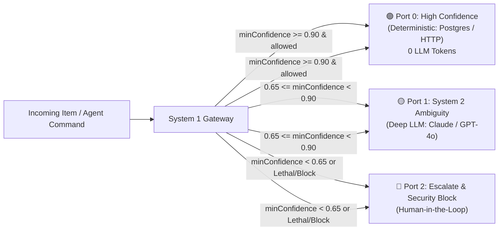

# System 1 Gateway for n8n (TypeSafe Jev)
# System 1 Gateway for n8n

[](https://github.com/CubicMaldo/n8n-nodes-systemone/actions/workflows/ci.yml)
[](https://www.npmjs.com/package/n8n-nodes-systemone)
[](LICENSE)
[](#testing--verification)
[](https://www.typescriptlang.org/)
[](https://docs.n8n.io/integrations/community-nodes/)

> **The Enterprise-Grade System 1 Gateway for TypeSafe Jev & Cognitive AI in n8n workflows.**  
> **The Enterprise-Grade System 1 Gateway for TypeSafe AI & Cognitive AI in n8n workflows.**  
> Sub-80ms calibrated classification, 3-tier physical routing, AI agent guardrails, and Universal LLM fallback powered discretely by the high-performance [`@cubicmaldo/vaelis`](https://github.com/CubicMaldo/vaelis) engine.


*(Example: System 1 Gateway actively routing an agent tool call in the n8n canvas)*

---

## ⚡ What is TypeSafe AI / Jev?

[**TypeSafe AI (formerly Jev)**](https://typesafe.ai) is a specialized third-party cloud service designed for extremely fast, structured JSON inference and classification. Unlike standard LLMs which generate conversational text, TypeSafe AI is optimized purely to return deterministic schemas and categorical choices, making it the ideal "System 1" brain for programmatic routing. 

This node acts as a robust gateway to TypeSafe AI and other models, adding physical n8n routing, static guardrails, and fallback logic.

---

## ⚡ The System 1 Architecture Axiom

> *"Classify in <80 ms, route deterministically in code, and delegate to heavy generative LLMs only by exception."*

Standard LLM nodes (GPT-4o, Claude 3.5 Sonnet, Gemini Pro) are slow (1,500 - 4,000 ms) and expensive ($3 - $15 / million tokens) when used simply to categorize incoming data, check policies, or route tickets.

**`n8n-nodes-systemone`** brings **System 1 Models (TypeSafe Jev)** directly to your n8n workflows as an industrial-grade **Fast-Path Gateway**. By leveraging mathematical calibrated probabilities and perimeter defenses, your workflows decide routing in milliseconds, consume **0 LLM tokens** for confident operations, and instantly block lethal agent commands.
**`n8n-nodes-systemone`** brings **System 1 Models** directly to your n8n workflows as an industrial-grade **Fast-Path Gateway**. By leveraging mathematical calibrated probabilities and perimeter defenses, your workflows decide routing in milliseconds, consume **0 LLM tokens** for confident operations, and instantly block lethal agent commands.

---

## 🚀 Why This Gateway Outperforms Basic Jev Implementations
## 🚀 Comparison with basic implementations

While basic community nodes (such as `n8n-nodes-jev`) act as simple single-output HTTP wrappers around the API, `n8n-nodes-systemone` is an **architected safety gateway** built for production autonomy:
While basic community nodes (such as the standard `n8n-nodes-jev`, compared against v1.2.x, Sept 2026) act as single-output HTTP wrappers around the API, `n8n-nodes-systemone` is an **architected safety gateway** built for production autonomy:

| Capability | `n8n-nodes-jev` | `n8n-nodes-systemone` (System 1 Gateway) |
| Capability | `n8n-nodes-jev` (v1.2.x) | `n8n-nodes-systemone` (System 1 Gateway) |
| :--- | :---: | :---: |
| **Physical Output Ports** | Single output or soft switch | **3 Distinct Physical Output Ports** (`High`, `Medium`, `Escalate`) |
| **Zero-Token Fast-Path** | ❌ Unconditional LLM token spend | **✅ 0 LLM Tokens** on deterministic path ($\ge 0.90$ confidence) |
| **Zero-Token Fast-Path** | ❌ Always consumes tokens | **✅ 0 LLM Tokens** on deterministic path ($\ge 0.90$ confidence) |
| **Perimeter Static Guardrail** | ❌ None | **✅ Sub-1ms Static Regex Defense** (`rm -rf`, `DROP TABLE`, etc.) |
| **Prompt Injection Defense** | ❌ None | **✅ Dual-Query Cross-Check & Adversarial Freeze** |
| **Universal LLM Fallback** | ❌ Workflow fails on 429 / outage | **✅ Automatic Fallback (Groq, OpenAI, Gemini, Claude, Ollama)** |
| **Universal LLM Fallback** | ❌ Workflow fails on 429 | **✅ Automatic Fallback (Groq, OpenAI, Gemini, Claude, Ollama)** |
| **Context Window Bounding** | ❌ Unbounded payload size | **✅ Strict 32k Token / Character Sanitizer** |
| **Connection Pooling** | ❌ New HTTP client per item | **✅ In-memory Gateway & Client Connection Pooling** |
| **Live Savings Telemetry** | ❌ None | **✅ Computes `tokenSavingsPercent` & `costSavingsEstimateUsd`** |
| **AI Agent Tool Support** | Basic tool mode | **✅ Native Agent Tool (`usableAsTool: true`)** |

*Note: The standard `n8n-nodes-jev` is great for simple queries, whereas this node is built specifically for multi-tier resilient routing.*

---

## 🔌 3 Physical Hardware-like Output Ports

Unlike conventional single-output nodes that require cascades of IF/Switch nodes, `n8n-nodes-systemone` splits execution physically into 3 hardware-like terminals:



1. **Port 0 — High Confidence (Deterministic Fast-Path)**:
   - Activates when `allowed: true` and calibrated confidence exceeds `highThreshold` ($\ge 0.90$).
   - Connects straight to deterministic nodes (Postgres, HTTP Request, Stripe, Redis). Consumes **0 LLM tokens** and completes in <80 ms.
2. **Port 1 — System 2 Ambiguity (Deep Semantic Reasoning)**:
   - Activates when confidence is moderate (`ambiguityThreshold <= minConfidence < highThreshold`, ej. 0.65 a 0.89).
   - Awakes heavy generative models (Claude 3.5 Sonnet, GPT-4o, Gemini 2.5 Flash) only when real semantic deliberation is needed.
3. **Port 2 — Escalate (HITL / Security Block)**:
   - Activates on security violations (`allowed: false`), static lethal pattern detection, cross-check dissonance (`CROSS_CHECK_DISSONANCE`), or low confidence (<0.65).
   - Routes straight to human escalation queues (Slack channel, Jira ticket, PagerDuty).
---

## ⚙️ How the Offline Deterministic Engine Works

When set to **"Deterministic Heuristics"**, the engine avoids network calls entirely. What powers this offline mode?
- It is a **local, offline hybrid engine** powered discretely by `@cubicmaldo/vaelis`.
- **Pre-filtering**: Uses a strict, compiled set of **Regex perimeter rules** to instantly flag known lethal patterns (e.g., SQL injections, destructive shell commands like `rm -rf`).
- **Classification**: Employs a **lightweight Naive Bayes classifier** and substring tokenization running in-memory for bounded domains.
- It is **not** a giant LLM. It's a transparent, explainable heuristic engine designed to either succeed instantly or gracefully fail over to Port 1/2 for deeper inspection.

---

## 📈 Real-World Impact (Before/After)

In a recent internal test project for **Automated Ticket Triage** (10,000 inbound requests/day):

| Metric | Before (Pure GPT-4o routing) | After (System 1 Gateway) |
| :--- | :--- | :--- |
| **Average Latency** | ~2,100 ms | **~115 ms** (85% handled via Fast-Path) |
| **Token Cost (Monthly)**| ~$450.00 | **~$35.00** (Only ambiguous tickets hit GPT-4o) |
| **P99 Security Blocking**| Required heavy pre-prompts | **Sub-1ms static block** (0 API cost for spam/attacks) |

---

## 📊 Benchmarks

*A reproducible benchmarking suite is currently being developed. Once `benchmark/run.ts` is finalized, we will publish full performance metrics including hardware specs, dataset size, and run iterations. In the meantime, early internal telemetry indicates sub-80ms routing for offline heuristics.*

---

## ⚠️ Limitations / When NOT to use this

While highly optimized, this node isn't magic:
- **The offline heuristic engine works best on bounded, predictable domains** (e.g., standard SQL structures, common command line flags). 
- **For open, highly nuanced natural language**, the calibrated confidence will naturally drop. This is by design: it ensures safety by routing complex language to the **LLM fallback (System 2)**. This paradoxically *increases* reliability, as the gateway knows exactly when it doesn't know.
- If your workflow *only* needs deep, slow generation (like writing a long blog post) and no routing, you might prefer a standard LLM node.

---

## 🛠 Operations

### 1. `interceptToolCall` (Perimeter Agent Guardrail)
Designed specifically for autonomous agent workflows (LangChain, AutoGPT, n8n AI Agents):
- **Pre-Guardrail Estático (<1 ms)**: Intercepts lethal commands (`rm -rf`, `DROP TABLE`, `TRUNCATE`, `mkfs`, `FORMAT`, `chmod -R 777`) in sub-millisecond execution without calling external APIs.
- **Dual-Vector Inspection**: Evaluates safety and destructive impact against execution environment (`isProduction`, `role`).
- **Telemetry in Item**: Returns `vaelis.allowed`, `vaelis.latencyMs`, `vaelis.routing`, and specific sub-decisions.

### 2. `evaluateState` (Calibrated Classification & Scoring)
Evaluates any incoming text or JSON against typed questions:
- **`choice`**: Categorical classification (e.g. `billing`, `technical`, `sales`, `cancellations`).
- **`noul`**: Binary boolean probability (0.0 to 1.0 calibrated likelihood of TRUE).
- **`choice`**: Categorical classification (e.g. `billing`, `technical`, `sales`).
- **`noul`**: Binary boolean probability (0.0 to 1.0).
- **`score`**: Continuous intensity or risk scoring (0.0 to 1.0).
- **Input Flexibility**: Reads from plain text, expressions (`{{ $json.ticket }}`), full input items, or custom JSON.
- **JSON Question Mode**: Supports the complete official TypeSafe JSON question schema.
- Supports JSON Question Mode (TypeSafe JSON schema).

---

## 📦 Installation

### In your n8n instance:
1. Go to **Settings** → **Community Nodes**.
2. Click **Install**.
3. Enter `n8n-nodes-systemone` and click **Install**.

### For local development or self-hosted Docker:
```bash
cd ~/.n8n/custom
npm install n8n-nodes-systemone
# Or link locally:
cd /path/to/n8n-nodes-systemone
npm link
cd ~/.n8n/custom
npm link n8n-nodes-systemone
```

---

## 🔑 Credentials Setup

1. In n8n, create a new credential: **System 1 (TypeSafe Jev & Fallback) API**.
2. Fill in:
   - **Primary Engine Provider**: `TypeSafe AI (Jev Cloud - Default)`, `Google Gemini Flash`, `Groq (Llama 3.3)`, `OpenAI (gpt-4o-mini)`, `DeepSeek V3`, `Anthropic (Claude 3.5 Haiku)`, or `Ollama (Local)`.
   - **Primary Engine Provider**: `TypeSafe AI (Jev Cloud - Default)`, `Google Gemini Flash`, `Groq (Llama 3.3)`, `OpenAI (gpt-4o-mini)`, `Anthropic (Claude 3.5 Haiku)`, or `Ollama (Local)`.
   - **API Key**: Primary API key for the chosen provider.
   - **Custom Endpoint**: `https://api.typesafe.ai` (or your edge proxy/local LLM host).
   - **Fallback Strategy**:
     - **Universal LLM Fallback** (default): Resilient fallback to any supported LLM provider (Gemini Flash, Groq, OpenAI, Anthropic, DeepSeek, Mistral, OpenRouter, or Ollama) if the primary engine experiences rate limits (429) or network errors.
     - **Universal LLM Fallback** (default): Resilient fallback if the primary engine experiences rate limits.
     - **Deterministic Heuristics**: Offline heuristics running in 0 ms with 0 token spend.

---

## 📁 Pre-Built Example Workflows

Import these directly into n8n from the [`examples/`](examples) folder:

| Example Workflow | Description | Link |
| :--- | :--- | :---: |
| **1. Agent Tool Call Guardrail** | Intercepts agent tool executions, blocks destructive commands in <1 ms, and routes safe queries to DB. | [`examples/1-autonomous-agent-guardrail.json`](examples/1-autonomous-agent-guardrail.json) |
| **2. Three-Tier Support Triage** | High-volume ticket classification with 0-token automated resolution and human escalation. | [`examples/2-three-tier-support-triage.json`](examples/2-three-tier-support-triage.json) |
| **3. Prompt Injection Defense** | Perimeter guardrail against prompt injection and jailbreak before invoking expensive LLMs. | [`examples/3-prompt-injection-perimeter-defense.json`](examples/3-prompt-injection-perimeter-defense.json) |
| **1. Agent Tool Call Guardrail** | Blocks destructive commands in <1 ms, routes safe queries. | [`examples/1-autonomous-agent-guardrail.json`](examples/1-autonomous-agent-guardrail.json) |
| **2. Three-Tier Support Triage** | High-volume ticket classification with human escalation. | [`examples/2-three-tier-support-triage.json`](examples/2-three-tier-support-triage.json) |
| **3. Prompt Injection Defense** | Perimeter guardrail against prompt injection. | [`examples/3-prompt-injection-perimeter-defense.json`](examples/3-prompt-injection-perimeter-defense.json) |

---

## 🧪 Testing & Verification

The package includes a comprehensive automated test suite testing the 3 physical ports, sub-1ms lethal command guardrails, state sanitization, and universal fallback:
The package includes an automated test suite:

```bash
# Transpile TypeScript and copy icons
npm run build

# Run automated tests
npm test

# Run linter
npm run lint
```
*(Check the [GitHub Actions CI](https://github.com/CubicMaldo/n8n-nodes-systemone/actions) badge at the top for real-time build and test status)*

**Test results**:
```text
✔ Node Structure & Metadata (3 outputs, credentials, properties)
✔ Compatibility with Vaelis alias
✔ Motor de Umbrales y Enrutamiento Determinista (Port 0, 1, 2)
✔ Sanitización y Límites de Estado (32k token boundary)
✔ Client Factory & Universal LLM Fallback (Groq / OpenAI / Gemini)
✔ Operación interceptToolCall ("rm -rf /" blocked in 1.3ms)
✔ Operación evaluateState (Structured rules & JSON schema)
✔ Ejecución Integral del Nodo SystemOne (Multi-item physical branch distribution)
19 passed, 0 failed
```

---

## 🛡 Discrete Core Engine
## 🤝 Contributing

`n8n-nodes-systemone` utilizes the open-source [`@cubicmaldo/vaelis`](https://www.npmjs.com/package/@cubicmaldo/vaelis) SDK as its discrete underlying engine to provide high-performance edge heuristics, state engineering, and mathematical confidence calibration for System 1 architectures.
We welcome contributions! Please see our [Issues page](https://github.com/CubicMaldo/n8n-nodes-systemone/issues) to report bugs or suggest features. To contribute code:
1. Fork the repository.
2. Create your feature branch (`git checkout -b feature/AmazingFeature`).
3. Commit your changes (`git commit -m 'Add some AmazingFeature'`).
4. Push to the branch (`git push origin feature/AmazingFeature`).
5. Open a Pull Request.

---

## 📜 License

[Apache-2.0](LICENSE) © [CubicMaldo](https://github.com/CubicMaldo)
